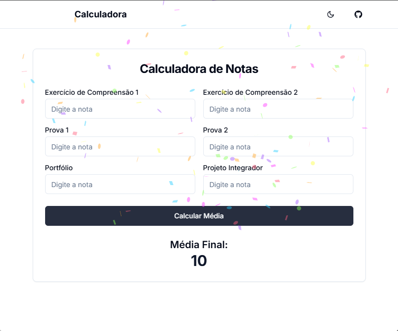

<h1 align="center" style="font-weight: bold;">Final Average Calculator 💻</h1>

<p align="center">
 <a href="#technologies">Technologies</a> • 
 <a href="#started">Getting Started</a> •
</p>

<p align="center">
    <b>Website created with the purpose of calculating the final academic average at Insted College, if the institution's official website is down or presents a final average that differs from that expected.</b>
</p>

<p align="center">
     <a href="https://calculadora-media-insted.vercel.app/" target="_blank"
              rel="noopener noreferrer">📱 Visit the Website</a>
</p>

<h2 id="layout">🎨 Layout</h2>

<p align="center">
    
</p>

<h2 id="technologies">💻 Technologies</h2>

- Next.js 15
- React 19
- TailwindCSS
- Shadcn UI
- TypeScript

<h2 id="started">🚀 Getting Started</h2>

<h3>Pré-requisitos</h3>

- [NodeJS](https://github.com/)
- [Git 2](https://github.com)

<h3>Cloning</h3>

```bash
git clone https://github.com/jjhonny/calculadora-media-insted
```

<h3>Starting</h3>

How to start your project

```bash
cd project-name
npm install
npm run dev
```
